# Diyar Kahramanları

Tarayıcıda çalışan bir **boşta ilerleyen (idle) RPG**. Kahraman topla, 6 kişilik takımını kur, yandan görünümlü
otomatik savaşlarda enerjiyle dolan aktif yeteneklerini izle, kampanyada ilerle, çevrimdışıyken ganimet biriktir
ve Kadim Kule'ye tırman.

- 6 grup, 5 sınıf ve tamamen **özgün** 30 kahraman (isimler, yetenekler, açıklamalar ve çizimler)
- Türün alışık olunan düzeni: yatay ekran, tıklanabilir binalarla çizgi film kasaba merkezi, boyalı sahnelerde
  yandan savaşan chibi kahramanlar, ganimet sandığı, çağrı sunağı ve kule; geniş telefonlarda çizimler ekranın
  kenarlarına kadar uzanır (kenarlarda boş şerit yok)
- **Bütün görseller kodla üretilir** (SVG/CSS): 30 kahramanın her biri ayrı tasarlanmış, canlandırılmış bir figür;
  kasaba, 6 savaş sahnesi, arayüzün bütün simgeleri ve savaş efektleri. Harici görsel, yazı tipi veya emoji yok
- Belirlenimci (deterministik) savaş motoru: aynı tohum her zaman aynı savaşı üretir
- Oyunun tüm metinleri Türkçe; TypeScript (strict) + Vite + saf DOM, arayüz kütüphanesi kullanılmıyor

> **Özgünlük notu:** Ekran düzeni, oranlar ve renk enerjisi Idle Heroes türündeki oyunları örnek alır; ancak hiçbir
> karakter, bina, logo, arayüz çizimi, isim veya metin kopyalanmadı. Her şey bu proje için sıfırdan çizildi: kasabanın
> merkezinde Sefer Kapısı'nı gövdesinde taşıyan, dallarında fenerler asılı dev bir çınar; savaş sahnelerinden biri
> fenerlerle aydınlanan, raylı bir kehribar madeni. Çağrı binası **Yıldız Sunağı**, kaynaklar **Altın**, **Gök Taşı**
> ve **Yakut** adını taşır.

## Ekran görüntüleri

Tarayıcı oyun testinden (1280×720 güvenli alan; `docs/screenshots/`):

| Kasaba (ana ekran) | Sefer Kapısı (kampanya) |
|---|---|
| 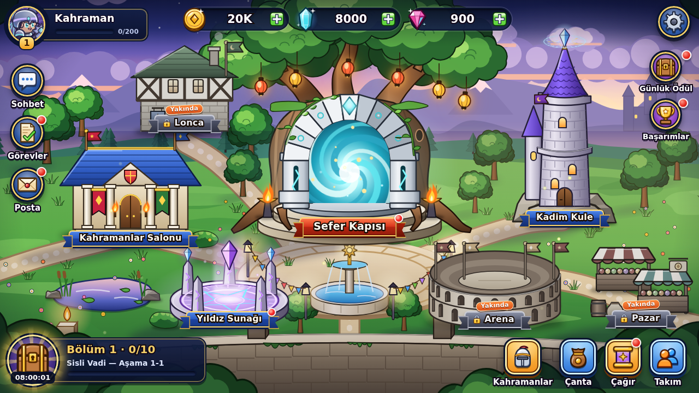 | 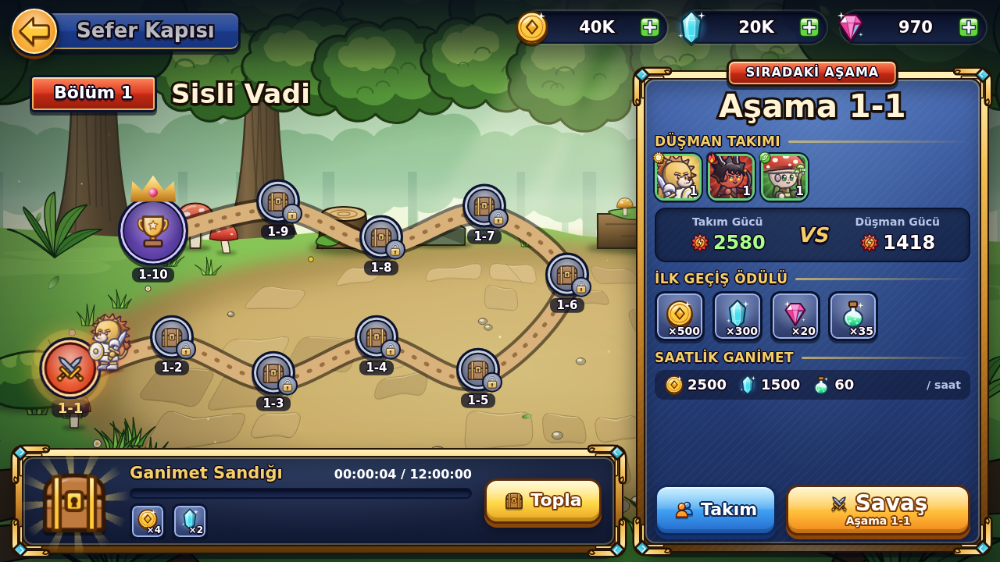 |

| Savaş | Aktif yetenek |
|---|---|
| 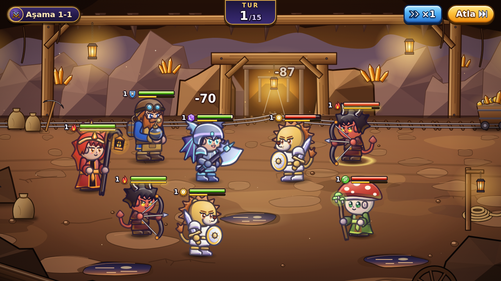 | 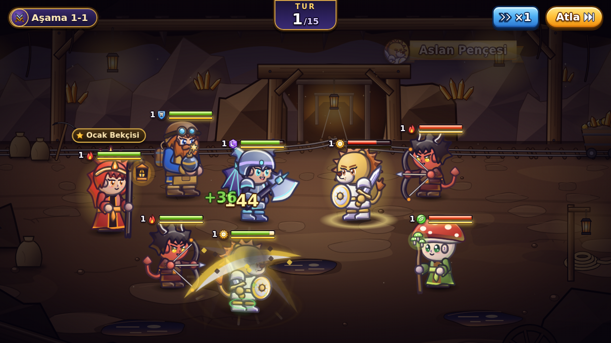 |

| Savaş sonucu | Savaşa hazırlık (takım düzeni) |
|---|---|
| 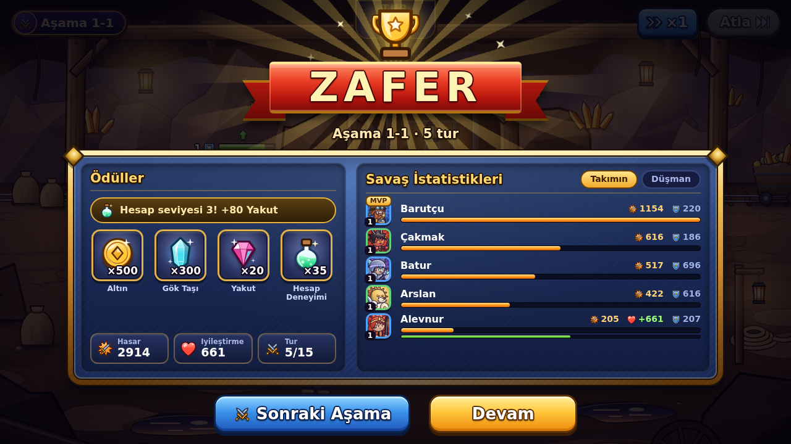 | 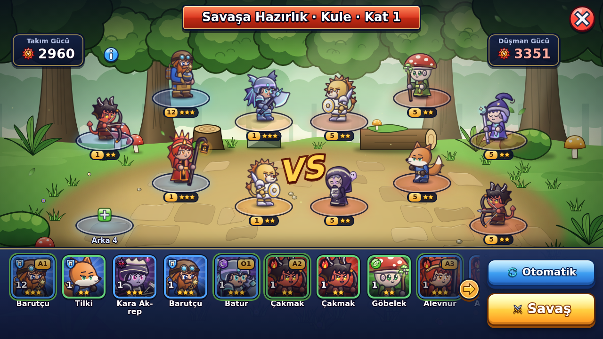 |

| Kahramanlar Salonu | Kahraman detayı |
|---|---|
| 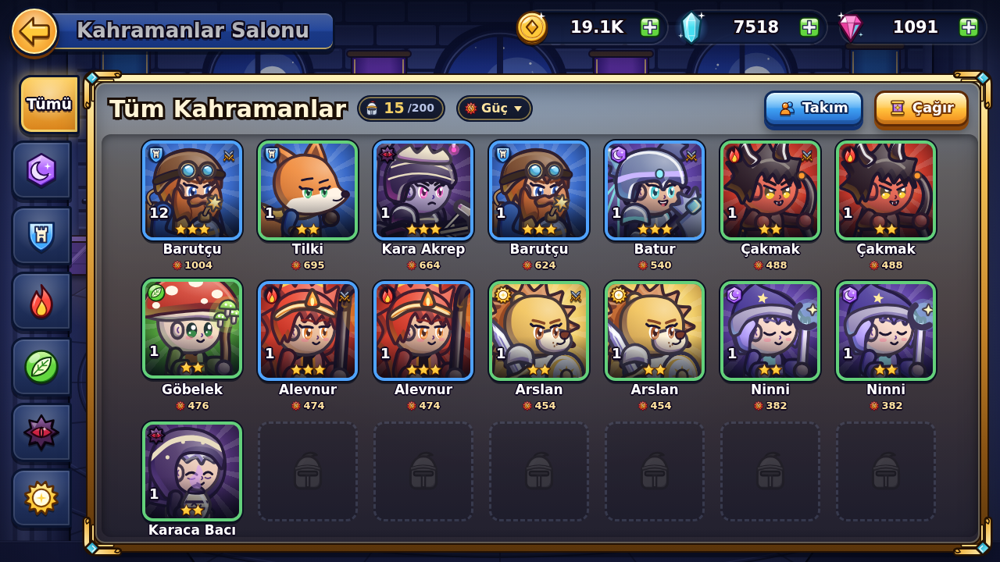 | 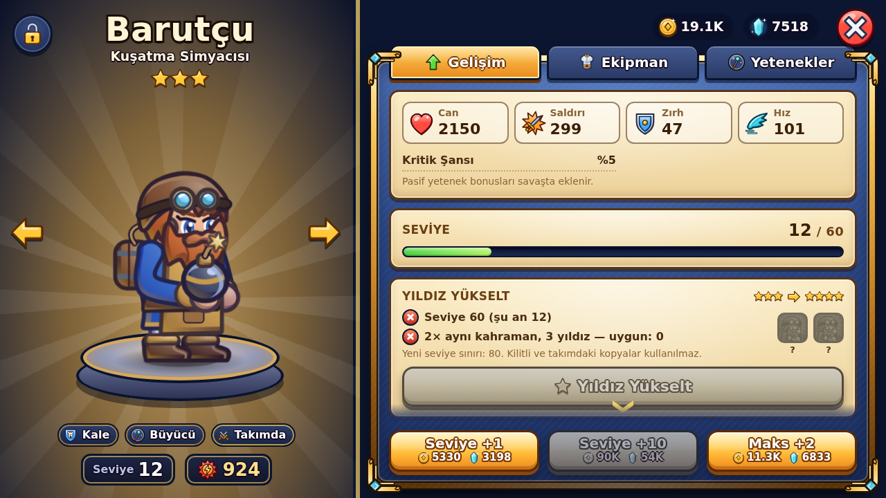 |

| Yıldız Sunağı (çağrı) | ×10 çağrı sonucu |
|---|---|
| 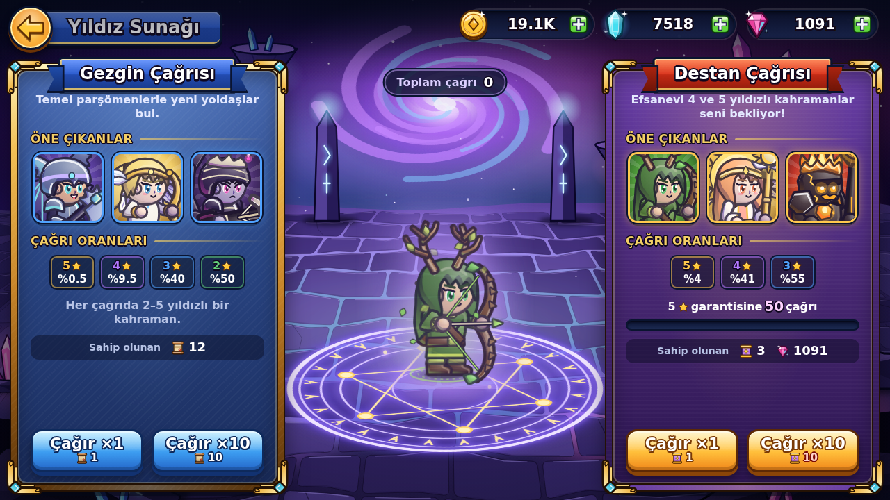 | 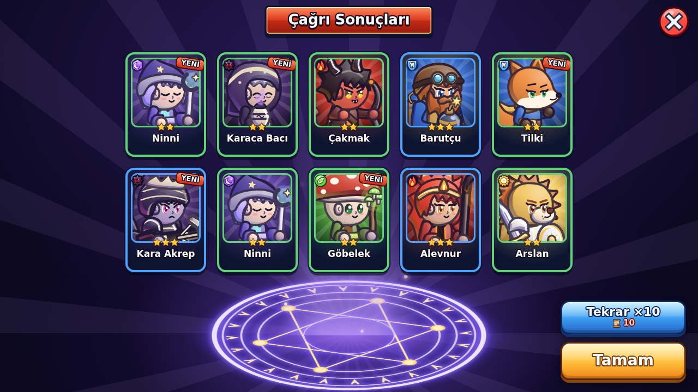 |

| Kadim Kule | Dikey telefon (sahne döndürülür) |
|---|---|
| 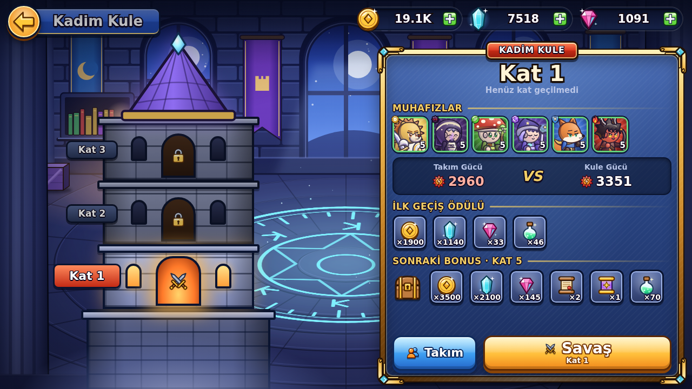 | 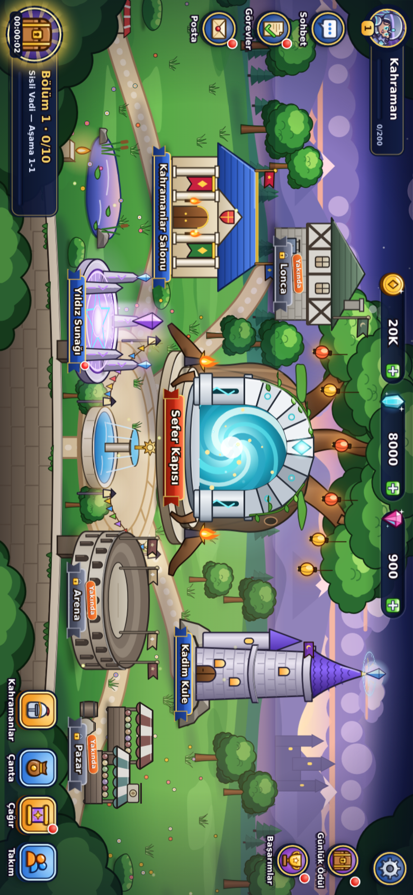 |

| Yatay telefon, 844×390 (tam ekran kasaba) | Yatay telefon, 844×390 (tam ekran savaş) |
|---|---|
| 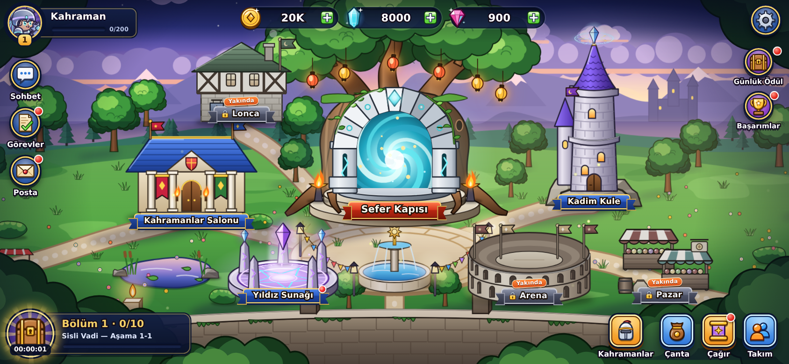 | 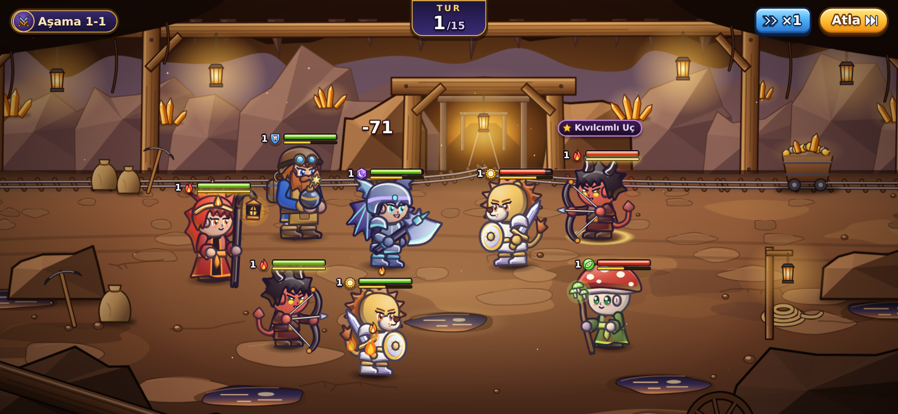 |

## Kurulum ve çalıştırma

Node.js 20 veya üstü gerekir.

```bash
npm install        # bağımlılıkları kur
npm run dev        # geliştirme sunucusu (http://localhost:5173)
npm test           # Vitest ile tüm testler
npm run typecheck  # yalnızca TypeScript tip denetimi
npm run build      # tip denetimi + üretim derlemesi (dist/)
npm run preview    # derlenmiş sürümü yerelde sun
```

Oyun 1280×720'lik sabit bir sahnede çizilir ve pencereye orantılı olarak sığdırılır. Bütün düğmeler bu güvenli
alanın içindedir; ekranın en-boy oranı farklıysa (ör. 2,16:1 telefon, 4:3 tablet) boyalı arka planlar ekranın
kenarlarına kadar uzar ve köşe düğmeleri (oyuncu plakası, kaynaklar, ayarlar, alt menü) gerçek ekran kenarlarına,
çentik payı bırakılarak yerleşir. Telefonda yatay tutmak idealdir; dikey tutulduğunda sahne 90° döndürülür ve bir
kez "telefonu yan çevir" ipucu gösterilir.

Kayıt tarayıcının `localStorage` alanında tutulur (`diyar-kahramanlari-save`). Oyunu sıfırlamak için kasabada
sağ üstteki dişli simgesiyle **Ayarlar → Oyunu Sıfırla** düğmesini kullan. Oyun iki sekmede açıksa, başka bir sekme daha
yeni bir kayıt yazdığında eski sekme kaydetmeyi bırakır ve üstte **Sayfayı Yenile** uyarısı gösterir (böylece
eski sekme yeni ilerlemenin üzerine yazamaz). Tarayıcı kaydetmeye izin vermiyorsa (ör. depolama dolu) de üstte
bir uyarı çıkar.

### Geliştirici galerileri

`npm run dev` açıkken iki ek sayfa çizimleri tek tek incelemeyi sağlar (üretim derlemesine girmezler; `npm run build`
yalnızca `index.html`'i paketler):

- **`/gallery-heroes.html`** — 30 kahramanın figürü ve portresi, 6'ya 6 savaş dizilimi önizlemesi; başlıktaki
  düğmeler tüm figürlerde animasyon oynatır (saldırı, büyü, darbe, ölüm, zafer), figüre tıklamak animasyonları
  sırayla döndürür. Adres seçenekleri: `?heroes=id1,id2`, `?nostage`, `?portraits=120`.
- **`/gallery-env.html`** — 16/24/48 px simgeler (koyu ve açık zemin), 6 savaş sahnesi, her sahnenin tam taşma
  (1760×1020) önizlemesi, kasaba (kilit, rozet ve HUD bantları anahtarlarıyla), efekt oyun alanı ve gerçek
  kahramanlarla sahne kompozisyonu önizlemesi.

Denge simülasyonunun tablosunu görmek için:

```bash
npx vitest run tests/balance.test.ts --silent=false
```

## Proje yapısı

```
index.html             Oyunun tek sayfası (üretim derlemesinin tek girişi)
gallery-heroes.html    Geliştirici galerisi: kahraman figürleri (yalnızca dev sunucusunda)
gallery-env.html       Geliştirici galerisi: simgeler, sahneler, kasaba, efektler (yalnızca dev sunucusunda)
docs/
  SPEC.md              Oyun kuralları, arayüz düzeni ve modül sözleşmeleri (tek doğruluk kaynağı)
  screenshots/         Tarayıcı oyun testinden ekran görüntüleri
src/
  main.ts              Giriş noktası: Game'i yükler, arayüzü sahneye bağlar
  style.css            Çizgi film arayüz teması: düğmeler, paneller, ekranlar, animasyonlar
  core/                Oyun mantığı (DOM'dan bağımsız, saf TypeScript)
    types.ts           Paylaşılan tipler (kahraman, savaş olayları, kayıt durumu…)
    constants.ts       Kurallar ve ayar sabitleri (grup üstünlüğü, enerji, zırh…)
    rng.ts             Tohumlanabilir rastgele sayı üreteci
    battle/            Savaş motoru: birim kurulumu, hedefleme, hasar, etkiler,
                       pasifler, tur akışı; giriş: simulateBattle()
    stats.ts           Seviye/yıldız/ekipmana göre statlar ve güç puanı
    progression.ts     Seviye atlatma, yıldız yükseltme, serbest bırakma, ekipman, hesap seviyesi
    summon.ts          Çağrı oranları, garanti (pity) ve kahraman havuzu
    campaign.ts        Aşamalar, zorluk eğrisi, ilk geçiş ödülleri, boşta gelir
    tower.ts           Kule katları ve ödülleri
    enemies.ts         Güç çarpanından düşman takımı üretimi
    formation.ts       Takım doğrulama ve otomatik dizilim
    save.ts            Yeni oyun, kayıt/yükleme, bozuk kayıt temizleme
    game.ts            Game deposu: durum + eylemler, kaydetme ve abonelere bildirme
  data/
    heroes.ts          30 kahramanın tanımları (statlar, aktif ve pasif yetenekler)
    equipment.ts       4 yuva × 6 kademe ekipman
  art/                 Kodla üretilen bütün görseller (giriş: index.ts)
    characters.ts      heroSprite / heroPortrait / setSpriteAnim; characters/ altında ortak iskelet,
                       yüz, gövde, teçhizat, kahraman başına tasarım (looks.ts) ve animasyonlar
    icons.ts           icon(): kaynak, grup, sınıf, durum, stat ve arayüz simgeleri
    scenes.ts          sceneBackground(): maden, orman, harabe, volkan, kule salonu, boşluk
    town.ts            townScene(): tıklanabilir binalarıyla kasaba
    vfx.ts             playVfx(): kesik, ok, büyü topu, patlama, iyileştirme, durum efektleri
    env/               Simge, sahne ve kasaba çizimlerinin parçaları
  ui/
    stage.ts           1280×720 sahne: ölçekleme, dikey ekranda döndürme, katmanlar, koordinat dönüşümü
    app.ts             Ekran geçişleri, kayıt uyarısı, değişiklik bildirimi
    hud.ts             Kaynak hapları, oyuncu plakası, sol düğmeler, bölüm ilerlemesi + sandık, alt simge sırası
    screens/           Kasaba (hub), Sefer Kapısı, Kahramanlar Salonu, Yıldız Sunağı, Kadim Kule
    modals/            Savaş, sonuç, takım düzeni, kahraman detayı (gelişim/ekipman/yetenek), çağrı sonucu,
                       çanta, ayarlar
    battle/            Savaş oynatımı: olay modeli, zamanlama, dizilim koordinatları, koreografi, sahne görünümü
    overlay.ts         Pencere (modal) yığını; modalGuards.ts: geri tuşu, çift dokunma kalkanı
    hints.ts           Bildirim noktaları, yıldız yükseltme işaretleri, hesap seviyesi ve kayıt uyarıları
    components.ts …    Ortak parçalar (portre, kahraman kartı, düğme, ödül listesi), biçimlendirme, bildirimler
  gallery-*.ts         Geliştirici galerilerinin kodu
tests/                 Vitest testleri (içerik, savaş + fuzz, sistemler, kayıt, denge, çizimler, arayüz mantığı)
```

Mimari kural: `core/` ve `data/` hiçbir zaman DOM'a dokunmaz; arayüz yalnızca `Game` deposunun
sorgularını ve eylemlerini kullanır. Başarılı her eylem durumu kaydeder ve arayüzü yeniden çizer.

## Oynanış rehberi

### Gruplar ve üstünlük döngüsü

| Grup | Oyundaki simge | Üstün olduğu grup |
|---|---|---|
| Uçurum | kırmızı-turuncu alev | Orman |
| Orman | yeşil yaprak | Gölge |
| Gölge | mor altıgende hilal | Kale |
| Kale | mavi kalkanda kale burcu | Uçurum |
| Işık | altın güneş | Karanlık |
| Karanlık | koyu dikenli yıldızda kızıl göz | Işık |

Döngü: **Uçurum → Orman → Gölge → Kale → Uçurum**, ayrıca **Işık ↔ Karanlık** birbirine üstündür.
Üstün olduğun gruba saldırırken **+%30 hasar** ve **+%15 isabet** kazanırsın.

Sınıflar: **Savaşçı** (ön sıra tankı), **Büyücü** (alan hasarı), **Okçu** (tek hedef / çoklu vuruş),
**Suikastçı** (kritik ve arka sırayı / düşük canlıyı hedefler), **Rahip** (iyileştirme, güçlendirme, enerji).
Her grupta her sınıftan bir kahraman vardır.

### Takım ve savaş

- Takım 6 yuvadan oluşur: **2 ön sıra** ve **4 arka sıra**. Normal saldırılar önce ön sırayı hedefler,
  bu yüzden dayanıklı savaşçıları öne koy. **Takım → Otomatik** en güçlü 6 kahramanı yerleştirir; ön sırada
  yalnızca 2 yer olduğu için en güçlü iki savaşçıdan sonrakiler seçimde güçlerinin %80'iyle sayılır.
- Savaşlar otomatiktir ve en fazla **15 tur** sürer. Her turda birimler **hıza** göre sırayla hareket eder.
  15 tur sonunda iki taraf da ayaktaysa savunan taraf kazanır.
- **Enerji:** Her kahraman savaşa 50 enerjiyle başlar. Normal saldırı +50, hasar almak +10 enerji verir
  (en fazla 300). Enerji **100'e** ulaşınca sıradaki hamlede **aktif yetenek** kullanılır ve enerji sıfırlanır.
- **Durum etkileri:** Sersemletme, dondurma ve taşlaşma turu atlatır; susturma yetenek kullanımını engeller.
  Yanma, zehir ve kanama her tur sonunda hasar verir. Kontrol bağışıklığı kontrol etkilerine direnmeyi sağlar.
- **Pasifler:** Savaş başında, tur sonunda, vurulunca, saldırınca, müttefik ölünce veya kendisi ölünce
  tetiklenen pasif yetenekler savaşın gidişatını değiştirebilir.
- Savaşlar yandan görünür: takımın solda, düşman sağda. Yakın dövüşçüler hedefe koşup vurur, okçu ve büyücüler
  mermi atar; aktif yetenekte yeteneğin adı, kullananın portresiyle üstte belirir. Savaşı ×1 / ×2 / ×4 hızda izleyebilir (seçim hatırlanır) ya da
  **Atla** ile doğrudan sonuca geçebilirsin. **Savaş** düğmesi önce takımını düşmanla karşılaştıran bir hazırlık ekranı açar.

### Kampanya ve boşta gelir

- Her bölüm 10 aşamadır; her 10. aşama güçlü bir **bölüm sonu** savaşıdır. İlk geçişte altın, gök taşı,
  yakut ve hesap deneyimi kazanırsın; bölüm sonlarında ve her 5. aşamada parşömen de düşer.
- **Ganimet Sandığı** (kasabada sol altta ve Sefer Kapısı'nda) çevrimdışıyken bile dolar: altın, gök taşı, hesap deneyimi, temel parşömen ve
  ekipman. Gelir, geçtiğin en yüksek aşamayla artar; sandık son toplamadan itibaren en fazla **12 saat**
  biriktirir, ardından **Topla** ile alınmalıdır. Ne sıklıkla topladığın toplam kazancı değiştirmez.
- Sandık dolarken yeni bir aşama geçersen, o ana kadar biriken ganimet eski aşamanın oranıyla sandıkta
  saklanır; yeni oran yalnızca sonraki saatlere uygulanır. Cihaz saati ileri/geri alınırsa sandık donmaz,
  ama aynı süre iki kez ödenmez.
- Hesap seviyesi atladıkça yakut kazanırsın.

### Kahraman gelişimi

- **Seviye:** Altın ve gök taşı harcanır; maliyet seviyeyle birlikte (~seviye^1,6) artar.
- **Seviye sınırı** yıldıza bağlıdır: 1★ 20, 2★ 40, 3★ 60, 4★ 80, 5★ 100.
- **Yıldız yükseltme:** Kahraman seviye sınırındayken, aynı kahramanın aynı yıldızdaki kopyaları tüketilir:
  1★→2★ 1 kopya, 2★→3★ 2 kopya, 3★→4★ 2 kopya, 4★→5★ 3 kopya. Kilitli ve takımdaki kopyalar kullanılmaz;
  tüketilen kopyaların seviye maliyetleri iade edilir, ekipmanları depoya döner.
- **Ekipman:** Silah, Zırh, Miğfer ve Çizme yuvaları, 6 kademe. **En İyisini Kuşan** depodaki en iyi
  eşyaları takar.
- **Serbest Bırak:** İhtiyacın olmayan kahramanı bırakırsan seviye maliyetinin tamamı ve yıldızına göre
  bir ödül geri gelir. Önemli kahramanları detay ekranındaki kilit düğmesiyle kilitle.

### Çağrı oranları

| Çağrı | Bedel | 2★ | 3★ | 4★ | 5★ |
|---|---|---|---|---|---|
| Gezgin Çağrısı | 1 Temel Parşömen | %50 | %40 | %9,5 | %0,5 |
| Destan Çağrısı | 1 Kahraman Parşömeni veya 300 Yakut (10'lu: 2700 Yakut) | — | %55 | %41 | %4 |

- Destan Çağrısı'nda **50 çağrı** içinde 5★ çıkmazsa 50. çağrı kesin 5★ olur (garanti sayacı 5★ gelince sıfırlanır).
- Işık ve Karanlık grubunun 5★ kahramanları, diğer 5★'lara göre yarı olasılıkla çıkar.
- En fazla 200 kahraman taşıyabilirsin.

### Kadim Kule

- Her kat, aynı numaralı kampanya aşamasından daha zordur ve her zaman 6 düşman içerir.
- Her katın ilk geçişi altın, gök taşı, yakut ve deneyim verir; **her 5. kat** ek olarak 100 yakut,
  1 Kahraman Parşömeni ve 2 Temel Parşömen içeren bir bonus kattır.

## Testler

`npm test` şunları kapsar:

- **İçerik:** kimliklerin/isimlerin benzersizliği, stat aralıkları, yetenek yapısı ve açıklamalardaki sayıların
  gerçek değerlerle eşleşmesi; ayrıca gerçek motorla binlerce savaşlık bir kahraman dengesi koruması (her kahraman
  kendi nadirlik ortalamasına yakın, zaman aşımı ve kontrol kilidi seyrek, pasiflerin ölçülebilir etkisi var)
- **Savaş:** formüller, durum etkileri, pasif tetikleme sırası; ayrıca yüzlerce rastgele savaşta değişmezleri
  denetleyen bir fuzz testi (determinizm, can hesabı, ölülerin hareket etmemesi…)
- **Sistemler:** seviye/yıldız/ekipman akışları, çağrı oranları ve garanti, boşta gelir (saat oynamaları dahil),
  kayıt dayanıklılığı ve çoklu sekme koruması, otomatik dizilimin gerçek savaşta daha güçlü takımı seçmesi
- **Denge:** gerçek savaş motoruyla 168 saatlik oyuncu simülasyonu ve ilerleme hedefleri
- **Çizimler:** her kahramanın kendine özgü tasarımı, figürlerde gerekli animasyon gruplarının ve geçerli SVG
  referanslarının bulunması, animasyon süreleri; her simgenin, sahnenin ve kasaba binasının eksiksiz olması, binaların
  HUD alanlarına taşmaması; hiçbir çizimde emoji olmaması
- **Arayüz mantığı:** biçimlendirme, savaş oynatım modelinin motorla birebir uyumu (güçlendirme bitişleri dahil),
  oynatma hızı ve zamanlama, savaş dizilimi (sütun aralıkları, can çubuklarının başlara binmemesi) ve yetenek
  koreografisi, sahne ölçekleme/döndürme ve tam taşma (bleed) hesabı, pencere (modal)
  yığını, geri tuşu ve odak yönetimi, sayfa kabuğu (yakınlaştırma izni), arayüz kodunda emoji olmaması

## Sonraki adımlar

Oyunu daha özgün kılmak için fikirler:

- **Kasabanın kilitli binaları:** Arena (oyuncu takımlarına karşı), Lonca ve Pazar şimdilik "Yakında" durumunda;
  Sohbet, Görevler, Posta, Günlük Ödül ve Başarımlar düğmeleri de yer tutucu.
- **Diyar haritası:** Bölüm haritalarını Anadolu ve Orta Asya efsanelerinden esinlenen bölgelerle (Kaf Dağı,
  Ergenekon vadisi, Tepegöz'ün mağarası) dallanan bir dünya haritasına bağlamak.
- **Destan zincirleri:** Aynı efsaneden gelen kahramanlar birlikte dizilince açılan ortak bonuslar ve kısa
  hikâye sahneleri.
- **Hava ve gün döngüsü:** Gece Gölge, gündüz Işık kahramanlarını güçlendiren; fırtınanın enerji kazancını
  değiştirdiği dönen savaş koşulları.
- **Obalar (loncalar):** Arkadaşlarla ortak bir oba kurup haftalık dev canavara (ör. Ak Aba Ejderi) karşı
  hasar yarışı.
- **Zanaat sistemi:** Ekipmanı demirci ocağında eritip yeniden dövme; kademe dışında rastgele “nakış”
  özellikleri ekleme.
- **Kahraman bağları:** Belirli ikililerin savaşta birbirini koruması veya birleşik yetenek kullanması.
- **Mevsimlik kule:** Her hafta farklı kurallarla (ör. yalnız Orman grubu, iyileştirme yok) sıfırlanan bir
  kule ve sıralama tablosu.
- **Ses ve müzik:** Kopuz/bağlama tınılarıyla Web Audio tabanlı hafif efektler.
- **Günlük görevler ve başarımlar:** Oturum başına küçük hedefler ve rozetler.
